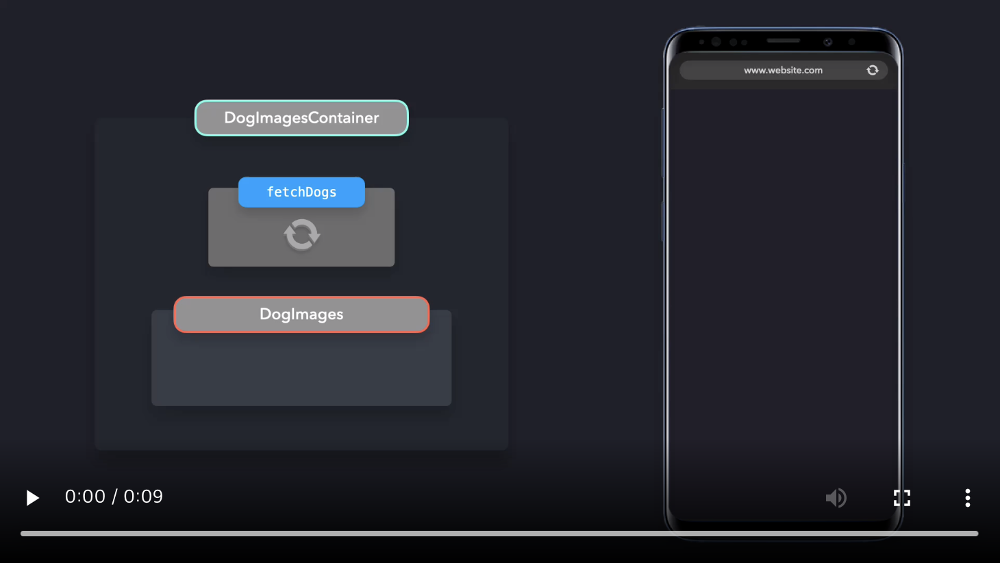
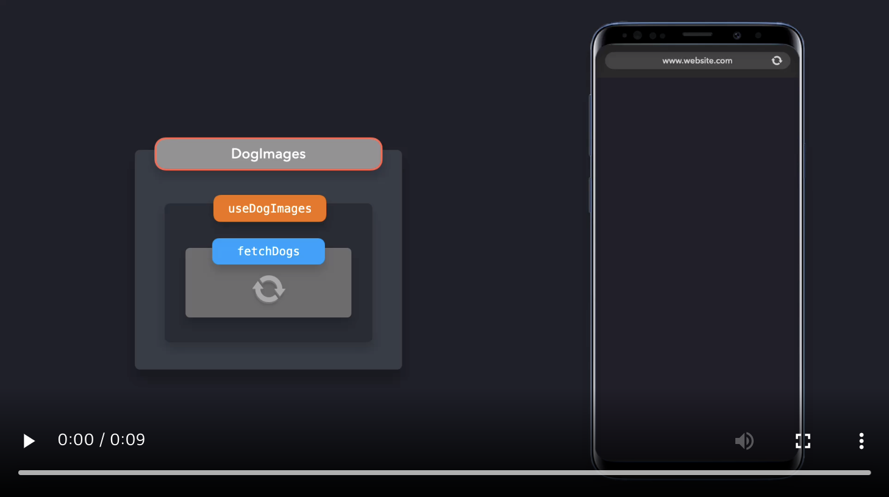

# Container/Presentational Pattern
어플리케이션 로직과 뷰 로직을 분리하여 관심사를 분리하기

<br />

---

React에서 관심사를 분리할 수 있는 한가지 방법은 Container/Presentational 패턴을 사용하는 것입니다. 이 패턴으로 어플리케이션 로직에서 뷰를 분리할 수 있습니다.

---

<br />

6개의 dog 이미지를 패치하여 스크린에 렌더링하는 어플리케이션을 만들고 싶다고 가정합시다.

이상적으로, 프로세스를 다음 두 부분으로 나누어서 관심사를 분리하려고 합니다.

1. Presentational Components: 사용자에게 데이터를 어떻게 보여줄 것인가를 관리하는 컴포넌트. 예제에서는, dog 이미지들을 렌더링하는 리스트에 해당.

2. Container Components: 어떤 데이터가 사용자에게 보여야 하는지를 관리하는 컴포넌트. 예제에서는, dog 이미지들을 패치하는 것에 해당.

[](https://res.cloudinary.com/ddxwdqwkr/video/upload/v1609056518/patterns.dev/jspat-40_af2vga.mp4)

dog 이미지들을 패치하는 것은 어플리케이션 로직을 다루는 반면에, 이미지들을 전시하는 것은 뷰를 다룹니다.

<br />

## Presentational Component

presentational 컴포넌트는 props로 데이터를 받습니다. 주요 기능은 데이터를 수정하지 않고, 스타일을 포함하여, 원하는 방식으로 데이터를 보여주는 것입니다.

```js
import React from "react";

export default function DogImages({ dogs }) {
  return dogs.map((dog, i) => );
}
```

`DogImages` 컴포넌트는 presentational 컴포넌트입니다.
Presentational 컴포넌트들은 보통 상태값을 가지고 있지 않는데(stateless)  즉, UI 목적으로 필요한 상태값이 아니라면 자신만의 React 상태값을 포함하지 않습니다. presentational 컴포넌트 자신은 받은 데이터를 변경하지 않습니다.

Presentational 컴포넌트들은 container 컴포넌트로부터 데이터를 받습니다.

<br />

## Container Components

container 컴포넌트의 주요 기능은 가지고 있는 데이터를 presentational 컴포넌트로 전달하는 것입니다. Container 컴포넌트 자체는 일반적으로 데이터를 관리하는 presentational 컴포넌트 외에 다른 구성 요소를 렌더링하지 않습니다. Container 컴포넌트 자체는 어떤 것도 렌더링하지 않으므로, 보통 스타일과 관련한 어떤 로직도 포함하지 않습니다.

예시에서 dog 이미지들을 `DogsImages` presentational 컴포넌트로 전달하려고 합니다. 그전에, 외부 API에서 이미지들을 패치해야 합니다. Container 컴포넌트를 생성하여 데이터를 패치하고 이 데이터를 화면에 이미지를 띄울 presentational 컴포넌트인 `DogImages`로 전달합니다.

```js
import React from "react";
import DogImages from "./DogImages";

export default class DogImagesContainer extends React.Component {
  constructor() {
    super();
    this.state = {
      dogs: []
    };
  }

  componentDidMount() {
    fetch("https://dog.ceo/api/breed/labrador/images/random/6")
      .then(res => res.json())
      .then(({ message }) => this.setState({ dogs: message }));
  }

  render() {
    return <DogImages dogs={this.state.dogs} />;
  }
}

```

이 두 컴포넌트를 함께 결합하면 애플리케이션 로직을 뷰와 분리할 수 있습니다.

[](https://res.cloudinary.com/ddxwdqwkr/video/upload/v1609056519/patterns.dev/jspat-45_budnfb.mp4)

<br />

## Hooks

많은 경우에, Container/Presentational 패턴은 React Hooks으로 대체할 수 있습니다. Hooks의 도입으로 많은 개발자들은 state를 제공하는 container 컴포넌트로 없이 statefulness를 쉽게 추가하게 되었습니다.

`DogImagesContainer` 컴포넌트로 데이터를 패칭하는 로직을 사용하는 대신에, 커스텀 hook에서 이미지들을 패칭하여 dogs 배열을 반환할 수 있습니다.

```js
export default function useDogImages() {
  const [dogs, setDogs] = useState([]);

  useEffect(() => {
    fetch("https://dog.ceo/api/breed/labrador/images/random/6")
      .then(res => res.json())
      .then(({ message }) => setDogs(message));
  }, []);

  return dogs;
}
```

이 hook을 사용함으로써, 데이터를 패치하여 `DogImages` presentational 컴포넌트로 전달하는 `DogImagesContainer` container 컴포넌트로 감쌀 필요가 없어졌습니다. 대신, `DogImages` presentational 컴포넌트에서 바로 이 hook을 사용하면 됩니다.

```js
import React from "react";
import useDogImages from "./useDogImages";

export default function DogImages() {
  const dogs = useDogImages();

  return dogs.map((dog, i) => );
}
```

`useDogImages` hook을 사용해도 여전히 뷰를 어플리케이션 로직과 분리할 수 있습니다. `DogImages`컴포넌트에서 데이터를 수정하지 않고, `useDogImages` hook이 반환하는 데이터를 사용할 수 있습니다.

[](https://res.cloudinary.com/ddxwdqwkr/video/upload/v1609056518/patterns.dev/jspat-46_evhhpd.mp4)

Hook으로 Container/Presentational 패턴처럼 컴포넌트에서 뷰와 로직을 분리할 수 있습니다. container 컴포넌트 내부에 presentational 컴포넌트를 감싸는 별도의 레이어를 사용할 필요가 없어집니다.

## Pros

Container/Presentational 패턴을 사용하면 얻는 이점이 많습니다.

Container/Presentational 패턴은 관심사의 분리를 장려합니다. Presentational 컴포넌트는 순수 함수로 UI에 대한 책임이 갖는 반면에, container 컴포넌트는 어플리케이션의 데이터 상태에 대한 책임을 갖습니다. 이러한 점이 관심사를 쉽게 분리시킵니다.

Presentational 컴포넌트는 데이터를 수정하지 않고 단순히 보여주기 때문에 쉽게 재사용가능합니다. application 전반에서 다른 목적으로 presentational 컴포넌트를 재사용할 수 있습니다.

presentational 컴포넌트는 어플리케이션 로직을 변경하지 않기 때문에 디자이너와 같이 베이스 코드를 잘 몰라도 쉽게 수정할 수 있습니다. presentational 컴포넌트가 어플리케이션의 많은 부부에서 재사용된 경우, 변경은 app 전반에 걸쳐 일관되게 적용됩니다. 

presentational 컴포넌트는 보통 순수 함수이므로, 쉽게 테스트할 수 있습니다. 데이터 저장소(store)를 mocking할 필요 없이, 어떤 데이터에 기반하여 presentational 컴포넌트가 렌더링되는지 알고 있습니다.

## Cons

Container/Presentational 패턴은 어플리케이션 로직을 렌더링 로직에서 쉽게 분리할 수 있게 합니다. 그러나, Container/Presentational 패턴을 사용하지 않고 stateless한 함수형 컴포넌트를 클래스 컴포넌트에 다시 쓸 필요 없이, Hooks을 통해 같은 결과를 얻을 수 있습니다. 이젠 더 이상 상태값을 사용하기 위해 클래스 컴포넌트를 만들 필요가 없습니다.

여전히 Container/Presentational 패턴을 React Hooks와 더불어 사용할 수 있지만, 이 패턴은 작은 규모의 어플리케이션에서는 과할 수 있습니다.

