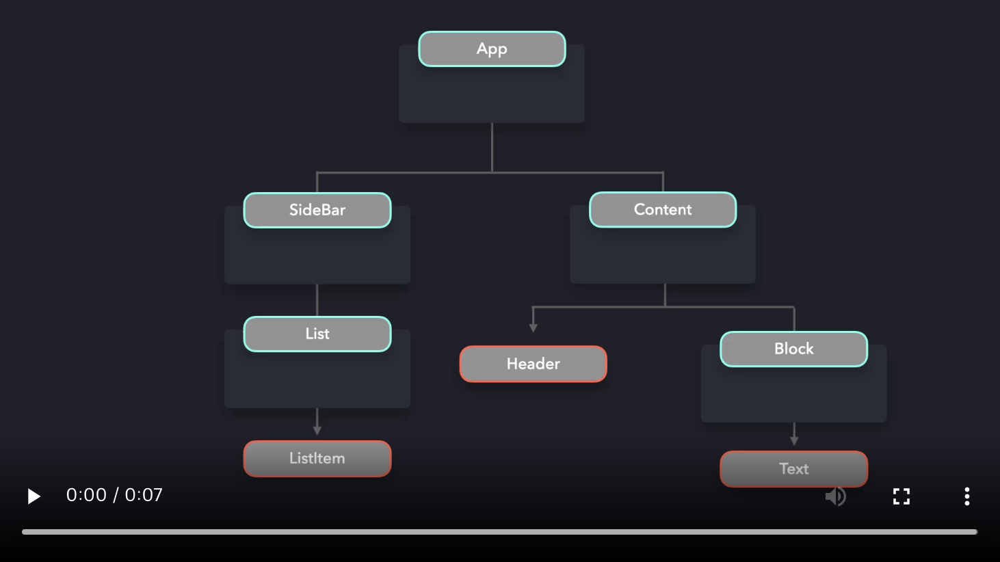

# Provider Pattern

경우에 따라 애플리케이션의 여러 구성 요소(전부는 아니더라도)에 데이터를 사용할 수 있도록 해야 합니다. `props`로 데이터를 컴포넌트로 전달할 수 있지만, 애플리케이션의 거의 모든 컴포넌트들이 props 값에 접근해야 한다면 까다롭습니다.

이것은 결국 *props drilling*을 유발하며, 이것은 컴포넌트 트리를 타고 내려가면서 props를 전달하는 경우입니다. props에 의존하는 코드를 개선하는 것은 거의 불가능해지고, 데이터가 어디로부터 왔는지를 파악하기 어려워집니다.

어떤 데이터를 포함하는 `App` 컴포넌트가 있다고 가정합시다. 컴포넌트 트리 아래에 위치한 `ListItem`, `Header`, `Text` 컴포넌트는 해당 데이터를 필요로 합니다. 이 컴포넌트들이 데이터를 얻기 위해서는 여러 컴포넌트 레이어를 거쳐서 데이터를 전달해야 합니다.

[](https://res.cloudinary.com/ddxwdqwkr/video/upload/v1609056518/patterns.dev/jspat-48_jxmuyy.mp4)

코드로 보면 아래와 같은 모양일 것입니다.
```js
function App() {
  const data = { ... }

  return (
    <div>
      <SideBar data={data} />
      <Content data={data} />
    </div>
  )
}

const SideBar = ({ data }) => <List data={data} />
const List = ({ data }) => <ListItem data={data} />
const ListItem = ({ data }) => <span>{data.listItem}</span>

const Content = ({ data }) => (
  <div>
    <Header data={data} />
    <Block data={data} />
  </div>
)
const Header = ({ data }) => <div>{data.title}</div>
const Block = ({ data }) => <Text data={data} />
const Text = ({ data }) => <h1>{data.text}</h1>
```

props를 위와 같은 방법으로 내려주는 것은 상당히 지저분합니다. 나중에 `data` prop명을 바꾸려 할 때, 모든 컴포넌트의 prop명을 변경해야 할 것입니다. 어플리케이션이 커지면 커질수록, prop drilling은 더 까다로워집니다.

이 데이터를 사용할 필요가 없는 컴포넌트 레이어들을 전부 생략하는게 최적일 것입니다.  prop drilling에 의존하지 않고도 컴포넌트가 `data` 값에 바로 접근할 수 있게 해주는 무언가가 필요합니다.

여기서 **Provider Pattern**이 도움이 됩니다! Provider Pattern의 도움으로, 우리는 여러 컴포넌트들이 데이터를 사용가능하게 할 수 있습니다. props로 각 레이어에 데이터를 내려주기 보다는, `Provider`로 모든 컴포넌트들을 감쌀 수 있습니다. Provider는 고차 컴포넌트로, `Context` 객체에서 제공합니다.React에서 제공하는 `createContext` 메소드를 사용하여  `Context` 객체를 만듭니다.

Provider 는 `value` props를 받으며, value props는 전달하고자 하는 데이터를 가지고 있습니다. provider로 감싼 모든 컴포넌트들은 `value` prop의 값에 접근할 수 있습니다.

```js
const DataContext = React.createContext()

function App() {
  const data = { ... }

  return (
    <div>
      <DataContext.Provider value={data}>
        <SideBar />
        <Content />
      </DataContext.Provider>
    </div>
  )
}
```

이제 더이상 일일히 `data` prop을 각 컴포넌트로 내려주지 않아도 됩니다! 그래서 어떻게 `ListItem`, `Header`, `Text` 컴포넌트는 `data`에 접근할 수 있을까요?

각 컴포넌트는 `useContext` hook을 통해서 `data`에 접근할 수 있습니다. 해당 hook은 `data`가 참조하고 있는 컨텍스트를 받습니다. 이 경우에 `DataContext`에 해당합니다. `useContext` hook으로 컨텍스트 객체에 데이터를 쓰고 읽을 수 있습니다.

```js
const DataContext = React.createContext();

function App() {
  const data = { ... }

  return (
    <div>
      <SideBar />
      <Content />
    </div>
  )
}

const SideBar = () => <List />
const List = () => <ListItem />
const Content = () => <div><Header /><Block /></div>


function ListItem() {
  const { data } = React.useContext(DataContext);
  return <span>{data.listItem}</span>;
}

function Text() {
  const { data } = React.useContext(DataContext);
  return <h1>{data.text}</h1>;
}

function Header() {
  const { data } = React.useContext(DataContext);
  return <div>{data.title}</div>;
}
```

`data` 값을 사용하지 않는 컴포넌트들은 `data`를 다룰 필요가 없습니다. 더이상 props의 값이 필요하지 않은 컴포넌트로 props를 몇단계 전달할 필요가 없으므로, 리팩터링이 훨씬 더 수월해집니다.

[](https://res.cloudinary.com/ddxwdqwkr/video/upload/v1609056519/patterns.dev/jspat-49_ksvtl8.mp4)

Provider 패턴은 전역 데이터를 공유할 때 매우 유용합니다. 다수의 컴포넌트들에 테마 UI 상태값을 공유하는 경우가 Provider 패턴의 대표적인 사용사례입니다.

여기 목록을 보여주는 간단한 앱이 있습니다. ([codesandbox](https://codesandbox.io/s/provider-1-ifz3w?from-embed=&file=/src/index.js))

사용자가 스위치를 토글(toggle)하면서 라이트모드와 다크모드를 교체할 수 있도록 하고 싶습니다. 사용자가 `dark-` 에서 라이트모드로 전환하거나 그 반대일 때에도, 배경 color와 텍스트 color가 변경되어야 합니다! 각 컴포넌트로 `theme` 값을 내려주는 대신에, `ThemeProvider`로 컴포넌트들을 감싸서 현재의 테마 색상들을 provider를 통해 전달할 수 있습니다.

```js
export const ThemeContext = React.createContext();

const themes = {
  light: {
    background: "#fff",
    color: "#000"
  },
  dark: {
    background: "#171717",
    color: "#fff"
  }
};

export default function App() {
  const [theme, setTheme] = useState("dark");

  function toggleTheme() {
    setTheme(theme === "light" ? "dark" : "light");
  }

  const providerValue = {
    theme: themes[theme],
    toggleTheme
  };

  return (
    <div className={`App theme-${theme}`}>
      <ThemeContext.Provider value={providerValue}>
        <Toggle />
        <List />
      </ThemeContext.Provider>
    </div>
  );
}
```

`Toggle`과 `List` 컴포넌트 둘 다 `ThemeContext` provider에 감싸져있어서, provider 값으로 전달한 `theme`, `toggleTheme`에 접근할 수 있습니다.

`Toggle` 컴포넌트 내부에서, 테마를 갱신하기 위해 `toggleTheme` 함수를 사용할 수 있습니다.

```js
import React, { useContext } from "react";
import { ThemeContext } from "./App";

export default function Toggle() {
  const theme = useContext(ThemeContext);

  return (
    <label className="switch">
      <input type="checkbox" onClick={theme.toggleTheme} />
      <span className="slider round" />
    </label>
  );
}
```

`List` 컴포넌트 자체는 현재 테마 값을 신경쓰진 않지만, `ListItem` 컴포넌트는 신경씁니다! `theme` 컨텍스트를 `ListItem` 에서 바로 사용 가능합니다.

```js
import React, { useContext } from "react";
import { ThemeContext } from "./App";

export default function TextBox() {
  const theme = useContext(ThemeContext);

  return <li style={theme.theme}>...</li>;
}
```

좋습니다! 현재 테마 값에 신경쓰지 않는 컴포넌트에는 어떤 데이터도 전달할 필요가 없습니다. ([codesandbox](https://codesandbox.io/s/provider-2-9djpl?from-embed))

<br />

## Hooks

컴포넌트에 컨텍스트를 제공할 때  hook을 사용할 수 있습니다. 각 컴포넌트에 `useContext`와 Context를 임포트하는 대신, 필요한 컨텍스트를 반환하는 hook을 사용할 수 있습니다.

```js
function useThemeContext() {
  const theme = useContext(ThemeContext);
  return theme;
}
```

유효한 테마인지 확인하기 위해, `useContext(ThemeContext)`가 falsy한 값을 반환하는 경우에 에러를 throw합시다.

```js
function useThemeContext() {
  const theme = useContext(ThemeContext);
  if (!theme) {
    throw new Error("useThemeContext must be used within ThemeProvider");
  }
  return theme;
}
```

`ThemeContext.Provider`로 컴포넌트들을 직접 감싸는 대신에, 해당 값들을 제공하기 위해 컴포넌트를 감싸는 HOC를 생성할 수 있습니다. 이렇게 컨텍스트 로직과 렌더링되는 컴포넌트를 분리하여 provider의 재사용성을 향상시킬 수 있습니다.

```js
function ThemeProvider({children}) {
  const [theme, setTheme] = useState("dark");

  function toggleTheme() {
    setTheme(theme === "light" ? "dark" : "light");
  }

  const providerValue = {
    theme: themes[theme],
    toggleTheme
  };

  return (
    <ThemeContext.Provider value={providerValue}>
      {children}
    </ThemeContext.Provider>
  );
}

export default function App() {
  return (
    <div className={`App theme-${theme}`}>
      <ThemeProvider>
        <Toggle />
        <List />
      </ThemeProvider>
    </div>
  );
}
```

Each component that needs to have access to the ThemeContext, can now simply use the useThemeContext hook.

이제 `ThemeContext`에 접근해야 하는 각 컴포넌트는 간단하게 `useThemeContext` hook을 사용합니다.

```js
export default function TextBox() {
  const theme = useThemeContext();

  return <li style={theme.theme}>...</li>;
}
```

각각 다른 컨텍스트마다 hook을 생성함으로써, provider의 로직과 데이터를 렌더링하는 컴포넌트의 로직을 쉽게 분리할 수 있습니다.


## Case Study

