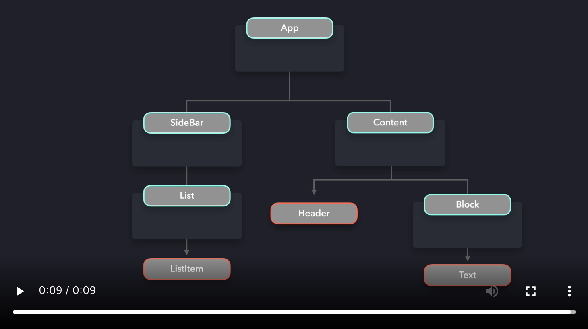

# Provider Pattern

경우에 따라 애플리케이션의 여러 구성 요소(전부는 아니더라도)에 데이터를 사용할 수 있도록 해야 합니다. `props`로 데이터를 컴포넌트로 전달할 수 있지만, 애플리케이션의 거의 모든 컴포넌트들이 props 값에 접근해야 한다면 까다롭습니다.

이것은 결국 *props drilling*을 유발하며, 이것은 컴포넌트 트리를 타고 내려가면서 props를 전달하는 경우입니다. props에 의존하는 코드를 개선하는 것은 거의 불가능해지고, 데이터가 어디로부터 왔는지를 파악하기 어려워집니다.

어떤 데이터를 포함하는 `App` 컴포넌트가 있다고 가정합시다. 컴포넌트 트리 아래에 위치한 `ListItem`, `Header`, `Text` 컴포넌트는 해당 데이터를 필요로 합니다. 이 컴포넌트들이 데이터를 얻기 위해서는 여러 컴포넌트 레이어를 거쳐서 데이터를 전달해야 합니다.

[](https://res.cloudinary.com/ddxwdqwkr/video/upload/v1609056518/patterns.dev/jspat-48_jxmuyy.mp4)

코드로 보면 아래와 같은 모양일 것입니다.
```js
function App() {
  const data = { ... }

  return (
    <div>
      <SideBar data={data} />
      <Content data={data} />
    </div>
  )
}

const SideBar = ({ data }) => <List data={data} />
const List = ({ data }) => <ListItem data={data} />
const ListItem = ({ data }) => <span>{data.listItem}</span>

const Content = ({ data }) => (
  <div>
    <Header data={data} />
    <Block data={data} />
  </div>
)
const Header = ({ data }) => <div>{data.title}</div>
const Block = ({ data }) => <Text data={data} />
const Text = ({ data }) => <h1>{data.text}</h1>
```

props를 위와 같은 방법으로 내려주는 것은 상당히 지저분합니다. 나중에 `data` prop명을 바꾸려 할 때, 모든 컴포넌트의 prop명을 변경해야 할 것입니다. 어플리케이션이 커지면 커질수록, prop drilling은 더 까다로워집니다.

이 데이터를 사용할 필요가 없는 컴포넌트 레이어들을 전부 생략하는게 최적일 것입니다.  prop drilling에 의존하지 않고도 컴포넌트가 `data` 값에 바로 접근할 수 있게 해주는 무언가가 필요합니다.

여기서 **Provider Pattern**이 도움이 됩니다! Provider Pattern의 도움으로, 우리는 여러 컴포넌트들이 데이터를 사용가능하게 할 수 있습니다. props로 각 레이어에 데이터를 내려주기 보다는, `Provider`로 모든 컴포넌트들을 감쌀 수 있습니다. Provider는 고차 컴포넌트로, `Context` 객체에서 제공합니다.React에서 제공하는 `createContext` 메소드를 사용하여  `Context` 객체를 만듭니다.

Provider 는 `value` props를 받으며, value props는 전달하고자 하는 데이터를 가지고 있습니다. provider로 감싼 모든 컴포넌트들은 `value` prop의 값에 접근할 수 있습니다.

```js
const DataContext = React.createContext()

function App() {
  const data = { ... }

  return (
    <div>
      <DataContext.Provider value={data}>
        <SideBar />
        <Content />
      </DataContext.Provider>
    </div>
  )
}
```