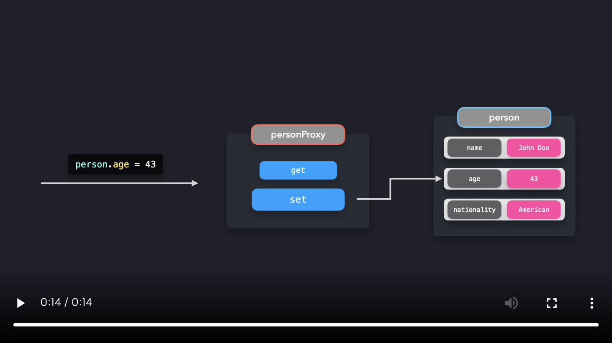

# Proxy Pattern

Proxy 객체를 사용하면 특정 객체와의 상호작용을 더 쉽게 제어할 수  있습니다. 객체와 상호작용할 때마다 Proxy 객체는 값을 가져오거나 설정하는 등 어떤 동작을 결정할 수 있습니다.

일반적으로, proxy는 무언가를 대신하는 대리인을 의미합니다. 어떤 사람을 직접적으로 말하는 대신에 당신이 연락하려던 사람을 대신할 대리인에게 말할 것입니다. 자바스크립트에서도 마찬가지로 목표 객체에 바로 상호작용하는 대신 Proxy 객체와 상호작용할 것입니다.


John Doe를 대표하는 `person` 객체를 생성합시다.

```js
const person = {
  name: "John Doe",
  age: 42,
  nationality: "American"
};
```

객체와 직접적으로 상호작용하는 대신, 우리는 proxy 객체와 상호작용하고 싶습니다. Javascript는 `Proxy`로 손쉽게 새로운 proxy를 생성할 수 있습니다.

```js
const person = {
  name: "John Doe",
  age: 42,
  nationality: "American"
};

const personProxy = new Proxy(person, {});
```

`Proxy`의 두번째 인자는 *handler*를 나타내는 객체입니다. handler 객체에서는 상호작용의 종류에 따른 특정 동작을 정의할 수 있습니다. Proxy handler에 추가할 수 있는 [많은 메소드들](https://developer.mozilla.org/en-US/docs/Web/JavaScript/Reference/Global_Objects/Proxy)이 있지만, `get`과 `set`이 가장 보편적으로 쓰입니다.

- `get` : 속성에 **접근**할 때 호출
- `set` : 속성을 **수정**할 때 호출

실제로, 다음과 같은 결과를 얻을 수 있습니다.

[](https://res.cloudinary.com/ddxwdqwkr/video/upload/v1609056520/patterns.dev/jspat-51_xvbob9.mp4)

`person` 객체와 직접 상호작용하는 대신, `personProxy`와 상호작용할 것입니다.

`personProxy` Proxy에 handler를 추가해봅시다. 속성을 수정하려 할 때, 즉 `Proxy`의 `set` 메소드를 호출할 때, Proxy에게 이전 값과 새 값을 출력하라고 하고 싶습니다.
속성에 접근하려 할 때, 즉 `get` 메소드를 호출할 때, Proxy에게 해당 속성의 key와 value를 포함한 가독성이 더욱 좋은 문장을 출력하라고 하고 싶습니다.

```js
const personProxy = new Proxy(person, {
  get: (obj, prop) => {
    console.log(`The value of ${prop} is ${obj[prop]}`);
  },
  set: (obj, prop, value) => {
    console.log(`Changed ${prop} from ${obj[prop]} to ${value}`);
    obj[prop] = value;
  }
});
```

완벽합니다! 속성을 수정하고 조회할 때 어떤 일이 벌어지는지 [codesandbox](https://codesandbox.io/embed/cocky-bird-rkgyo)에서 확인할 수 있습니다.

`name` 속성에 접근할 때, 더 읽기 좋은 문장을 반홥합니다. : ` The value of name is John Doe.`

`age` 속성을 수정할 때, Proxy 는 `age` 속성의 이전 값과 새 값을 반환합니다. : `Changed age from 42 to 43.`

Proxy 는 **검증**을 추가할 때 유용합니다. 사용자는 `person`의 `age`를 문자열 값으로 바꿀 수 없거나, 빈 값을 `name`으로 설정할 수 없습니다. 혹은 존재하지 않는 속성에 접근하려고 할 때, 사용자가 알 수 있도록 해야 합니다.

```js
const personProxy = new Proxy(person, {
  get: (obj, prop) => {
    if (!obj[prop]) {
      console.log(
        `Hmm.. this property doesn't seem to exist on the target object`
      );
    } else {
      console.log(`The value of ${prop} is ${obj[prop]}`);
    }
  },
  set: (obj, prop, value) => {
    if (prop === "age" && typeof value !== "number") {
      console.log(`Sorry, you can only pass numeric values for age.`);
    } else if (prop === "name" && value.length < 2) {
      console.log(`You need to provide a valid name.`);
    } else {
      console.log(`Changed ${prop} from ${obj[prop]} to ${value}.`);
      obj[prop] = value;
    }
  }
});
```

실패하는 값들을 넘기려 할 때 어떤 일이 벌어지는지 [codesandbox](https://codesandbox.io/embed/focused-rubin-dgk2v)에서 확인합시다!

Proxy 는 실패하는 값들로 `person` 객체를 수정할 수 없음을 보장하므로 개발자는 데이터를 순수하게 관리할 수 있습니다.

<br />

## Reflect

JavaScript `Reflect`라는 내장 객체를 제공하는데 Proxy들로 작업할 때 목표 객체를 더 쉽게 조작할 수 있도록 합니다.

이전에는, 괄호 연산자를 사용하여 Proxy로 값을 직접 가져오거나 설정하면서 목표 객체의 속성에 수정하고 접근하려고 했습니다. 이것 대신에, `Reflect` 객체를 사용할 수 있습니다. `Reflect` 객체의 메소드명은 handler 객체의 메소드명과 동일합니다.

`obj[props]` 으로 속성에 접근하거나 `obj[prop] = value`를 통해 속성을 설정하는 대신에 `Reflect.get()`, `Reflect.set()`으로 속성에 접근하고 수정합니다. handler 오브젝트의 메소드가 받는 인자와 동일한 인자를 받습니다.

```js
const personProxy = new Proxy(person, {
  get: (obj, prop) => {
    console.log(`The value of ${prop} is ${Reflect.get(obj, prop)}`);
  },
  set: (obj, prop, value) => {
    console.log(`Changed ${prop} from ${obj[prop]} to ${value}`);
    Reflect.set(obj, prop, value);
  }
});
```

완벽합니다! [codesandbox](https://codesandbox.io/embed/gallant-violet-o1hjx)에서 확인할 수 있듯이 `Reflect` 객체로 목표 객체의 속성에 쉽게 접근하고 수정할 수 있습니다.

Proxy 는 객체의 동작을 제어하는데 아주 유용한 방법입니다. Proxy 는 검증, 서식화, 알림, 디버깅과 같은 다양한 사용 사례가 있습니다.

Proxy 객체를 남용하거나 무거운 연산을 각 handler 메소드 호출마다 수행하면 당신의 어플리케이션의 성능에 좋지 않은 영향을 끼칩니다. 성능에 민감한 코드는 Proxy를 사용하지 않는 것이 좋습니다.