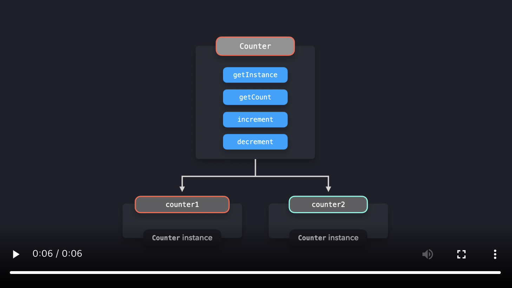
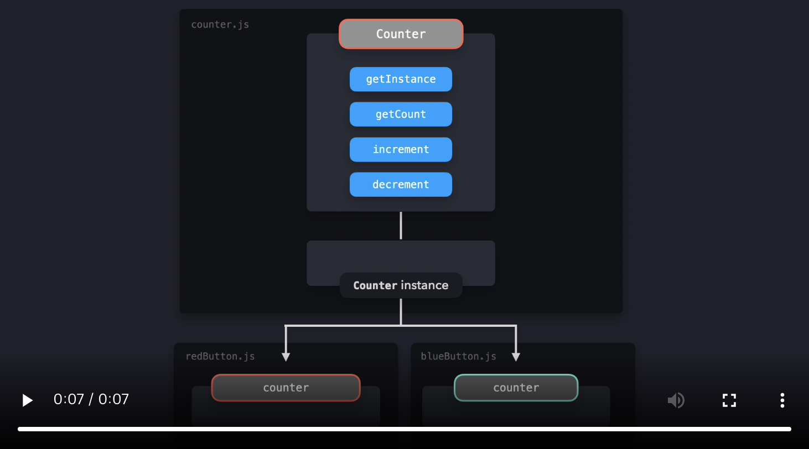

# Singleton Pattern

Singleton은 한번 인스턴스화하면 전역에서 접근이 가능한 클래스를 말합니다. 단일 인스턴스는 어플리케이션 전역에 걸쳐 공유할 수 있으므로 Singleton은 애플리케이션의 전역 상태를 관리하는 데 유용합니다.

먼저, ES2015의 클래스를 사용하여 Singleton에 대해 살펴봅시다.
이 예제에서 아래와 같은 Counter 클래스를 구현합니다.

```js
let counter = 0;

class Counter {
  getInstance() {
    return this;
  }

  getCount() {
    return counter;
  }

  increment() {
    return ++counter;
  }

  decrement() {
    return --counter;
  }
}
```


그러나, 해당 클래스는 Singleton의 기준을 만족하지 않습니다. Singleton은 한번만 인스턴스화할 수 있어야 합니다. 지금은 다수의 Counter 클래스의 인스턴스를 만들 수 있습니다.


```js
let counter = 0;

class Counter {
  getInstance() {
    return this;
  }

  getCount() {
    return counter;
  }

  increment() {
    return ++counter;
  }

  decrement() {
    return --counter;
  }
}

const counter1 = new Counter();
const counter2 = new Counter();

console.log(counter1.getInstance() === counter2.getInstance()); // false
```

`new` 메소드를 두 번 호출하여 두 개의 `counter1`와 `counter2`의 서로 다른 인스턴스로 설정하였습니다.

`counter1`와 `counter2`에서 `getInstance` 메소드가 반환하는 값들은 다른 인스턴스의 참조값을 효과적으로 반환합니다. 즉, 값이 완전히 동일하지는 않습니다!

[](https://res.cloudinary.com/ddxwdqwkr/video/upload/v1609056519/patterns.dev/jspat-52_zkwyk1.mp4)


단 하나의 Counter 클래스 인스턴스만을 만들 수 있는지 확인해봅시다.

단일 인스턴스가 생성됨을 확인할 수 있는 한가지 방법은 `instance`라는 변수를 생성하는 것입니다. 새 인스턴스를 만들 때, Counter의 생성자 내부에서 인스턴스의 참조값으로 `instance`를 설정할 수 있습니다. `instance` 변수가 이미 값이 존재하는지 검사하여 새로운 인스턴스화를 막을 수 있습니다. 이 경우, 인스턴스는 이미 존재합니다. 이 경우는 있어선 안됩니다. 따라서 사용자가 알도록 에러를 throw합니다.

```js
let instance;
let counter = 0;

class Counter {
  constructor() {
    if (instance) {
      throw new Error("You can only create one instance!");
    }
    instance = this;
  }

  getInstance() {
    return this;
  }

  getCount() {
    return counter;
  }

  increment() {
    return ++counter;
  }

  decrement() {
    return --counter;
  }
}

const counter1 = new Counter();
const counter2 = new Counter();
// Error: You can only create one instance!
```

완벽합니다! 더이상 다수의 인스턴스를 생성할 수 없습니다.

`counter.js` 파일로 Counter 인스턴스를 export해봅시다. 다만 그전에, 인스턴스 또한 **freeze**해야 합니다. `Object.freeze` 메소드는 `counter.js`를 사용하는 code에서 Singleton을 수정할 수 없음을 보장합니다.

동결된 인스턴스의 속성들은 추가되거나 수정될 수 없으므로 Singleton의 값들을 실수로 덮어쓰는 위험이 줄어듭니다.

```js
let instance;
let counter = 0;

class Counter {
  constructor() {
    if (instance) {
      throw new Error("You can only create one instance!");
    }
    instance = this;
  }

  getInstance() {
    return this;
  }

  getCount() {
    return counter;
  }

  increment() {
    return ++counter;
  }

  decrement() {
    return --counter;
  }
}

const singletonCounter = Object.freeze(new Counter());
export default singletonCounter;
```

Counter 예재를 구현하는 어플리케이션을 살펴봅시다. 아래의 파일들이 존재합니다.

- `counter.js` : Counter 클래스를 포함하며, Counter 인스턴스를 default export로 export합니다.
- `index.js` : `redButton.js`와 `blueButton.js` 모듈을 로드
- `redButton.js` : Counter를 import하여 Counter의 `increment` 메소드를 **red** 버튼의 이벤트 리스너로 추가합니다. 
그리고, 카운터의 현재 값을 `getCount` 메소드를 호출하여 기록합니다.
- `blueButton.js` : Counter를 import하여 Counter의 `increment` 메소드를 **blue** 버튼의 이벤트 리스너로 추가합니다. 
그리고, 카운터의 현재 값을 `getCount` 메소드를 호출하여 기록합니다.

`blueButton.js`과 `redButton.js` 모두 `counter.js`로부터 **동일한 인스턴스**를 import합니다. 해당 인스턴스는 두 파일에서 **`Counter`** 라는 이름으로 import됩니다.

[](https://res.cloudinary.com/ddxwdqwkr/video/upload/v1609056519/patterns.dev/jspat-56_wylvcf.mp4)

`redButton.js` 또는 `blueButton.js`의 `increment` 메소드를 호출하면, Counter 인스턴스의 `counter` 속성이 두 파일 모두 갱신됩니다. red 버튼을 눌렀는지, blue 버튼을 눌렀는지는 중요하지 않습니다. 즉, 같은 값을 모든 인스턴스들 사이에서 공유합니다. 이것이 우리가 다른 파일에서 메소드를 호출하고 있음에도 불구하고 카운터가 계속 1씩 증가하는 이유입니다.

<br />

## (Dis)advantages

단일 인스턴스를 인스턴스화하도록 강제하는 것은 잠재적으로 많은 메모리 공간을 절약할 수 있습니다. 매번 새 인스턴스에 메모리 공간을 할당하는 대신에 어플리케이션 전체에 걸쳐 참조될 단일 인스턴스의 메모리 공간만 설정하면 됩니다. 그러나 Singleton은 사실 **안티 패턴**으로 간주하여 Javascript에서 지양할 수 있어야(또는.. *지양해야*) 합니다.

Java나 C++ 같은 많은 프로그래밍 언어들에서 Javascript에서 할 수 있는 방식대로 객체를 직접 만들 수 없습니다. 이같은 객체 지향 프로그래밍 언어들에서는 객체를 생성하는 클래스를 생성해야 합니다. 생성된 객체는 Javascript 예제에서 본 `instance` 와 마찬가지로 클래스의 인스턴스 값을 가집니다.

그러나, 위 예제에서 본 클래스 구현은 사실 과잉입니다. 자바스크립트에서 객체를 직접 만들 수 있기 때문에 일반 객체를 사용하여 동일한 결과를 얻을 수 있습니다. 싱글톤을 사용할 때의 몇 가지 단점에 대해 알아보겠습니다!

<br />

### Using a regular object

이전에 본 예제와 동일한 예시를 봅시다. 그러나 이번엔 `counter`는 아래 내용을 포함한 단순 객체입니다.

- `count` 속성
- `count` 값을 1씩 증가시키는 `increment` 메소드
- `count` 값을 1씩 감소시키는 `decrement` 메소드

```js
let count = 0;

const counter = {
  increment() {
    return ++count;
  },
  decrement() {
    return --count;
  }
};

Object.freeze(counter);
export { counter };
```

객체는 참조를 통해 전달되므로, `redButton.js`와 `blueButton.js`는 동일 `singletonCounter` 객체의 참조를 import하고 있습니다. 이 파일들 중 하나에서 `count` 값을 수정하면 `singletonCounter`의 값을 수정하게 되고, 이 값은 두 파일 모두애 표시됩니다.

<br />

### Testing

싱글톤에 의존하는 코드를 테스트하는 것은 까다로울 수 있습니다. 매번 새 인스턴스를 만들 수 없기 때문에 모든 테스트들은 이전 테스트에서 전역 인스턴스의 변경 사항에 의존하게 됩니다. 이 경우 테스트의 순서가 중요하며, 하나의 작은 변경이 모든 테스트 셋이 실패할 수 있습니다.
테스트 이후, 테스트를 통해 수정한 내용을 재설정하기 위해 모든 인스턴스를 초기화해야합니다.

```js
import Counter from "../src/counterTest";

test("incrementing 1 time should be 1", () => {
  Counter.increment();
  expect(Counter.getCount()).toBe(1);
});

test("incrementing 3 extra times should be 4", () => {
  Counter.increment();
  Counter.increment();
  Counter.increment();
  expect(Counter.getCount()).toBe(4);
});

test("decrementing 1  times should be 3", () => {
  Counter.decrement();
  expect(Counter.getCount()).toBe(3);
});
```

<br />

### Dependency hiding

다른 모듈인 `SuperCounter.js`를 가져올 때 해당 모듈이 Singleton을 import하는 것인지 분명하지 않을 수 있습니다. `index.js`와 같은 다른 파일에서 해당 모듈을 import하여 내부 메소드를 호출할 것입니다. 이 경우 실수로 Singleton의 값을 수정할 수 있습니다. 이것은 예상치 못한 행동을 야기할 수 있는데, Singleton의 여러 인스턴스들이 동시에 수정될 수 있을 뿐만 아니라 어플리케이션 전체에 걸쳐 공유되기 때문입니다.

```js
import Counter from "./counter";

export default class SuperCounter {
  constructor() {
    this.count = 0;
  }

  increment() {
    Counter.increment();
    return (this.count += 100);
  }

  decrement() {
    Counter.decrement();
    return (this.count -= 100);
  }
}
```

<br />

### Global behavior
Singleton 인스턴스는 전체 앱에 걸쳐 참조될 수 있어야 합니다. 전역 변수는 근본적으로 동일한 양상을 보입니다. 즉, 전역 변수는 전역 스코프에서 사용 가능하기 때문에, 어플리케이션 전체에서 해당 변수들에 접근할 수 있습니다.

전역 변수를 사용하는 것은 일반적으로 나쁜 설계 결정으로 간주됩니다. 전역 스코프의 오염은 실수로 전역 변수의 값을 덮어쓰는 결과를 초래할 수 있으며, 예상치 못한 행동을 야기할 수 있습니다.

ES2015에서, 전역 변수의 생성은 상당히 드문 일입니다. `let`, `const`와 같은 새로운 키워드로 선언한 변수는 block-scoped를 유지하여  개발자가 실수로 전역 스코프를 오염시키지 않도록 합니다. Javascript의 모듈로부터 값을 내보내고(`export`) 다른 파일에서 값을 가져오는(`import`) 새로운 `module` 시스템으로 전역 스코프를 오염시키지 않으면서 전역적으로 접근이 가능한 값을 쉽게 생성할 수 있습니다.

그러나, 어플리케이션 전역에서 특정 **전역 상태값**을 가질 때 일반적으로 Singleton을 사용합니다. 코드베이스의 여러 부분을 동일 **mutable object**에 의존하게 하는 것은 예기치못한 동작을 유발합니다.

보통, 코드베이스의 특정 부분은 전역 상태 내의 값을 수정하는 반면 다른 부분은 해당 데이터를 사용합니다. 여기서 실행 순서는 중요합니다. 즉, (아직) 데이터를 사용하면 안될 때 데이터를 실수로 사용하는 것을 원치 않을 것입니다! 어플리케이션의 규모가 커져서 컴포넌트들이 서로 더 많이 의존하면 의존할수록, 전역 상태를 사용하는 데이터 흐름을 이해하는 것은 매우 까다로워집니다.

<br />

### State management in React

React에서, Singleton을 사용하는 대신에 Redux나 React Context와 같은 상태 관리 도구를 사용하여 전역 상태값에 의존하는 경우가 많습니다. 전역 상태값의 동작이 Singleton과 비슷해보이지만, 이 도구들은 Singleton에서의 mutable한 상태값 대신에 **읽기 전용 상태값**을 제공합니다. Redux를 사용하면, 컴포넌트가 dispatcher를 통해 action을 받은 후에 순수 함수인 리듀서가 상태를 갱신할 수 있습니다.

해당 도구들을 사용함으로써 전역 상태값을 사용하는 방식이 주는 단점이 마법처럼 사라지지는 않지만, 컴포넌트가 상태를 바로 변경할 수 없기 때문에 적어도 전역 상태값이 의도한대로 변경된다고 확신할 수 있습니다.

